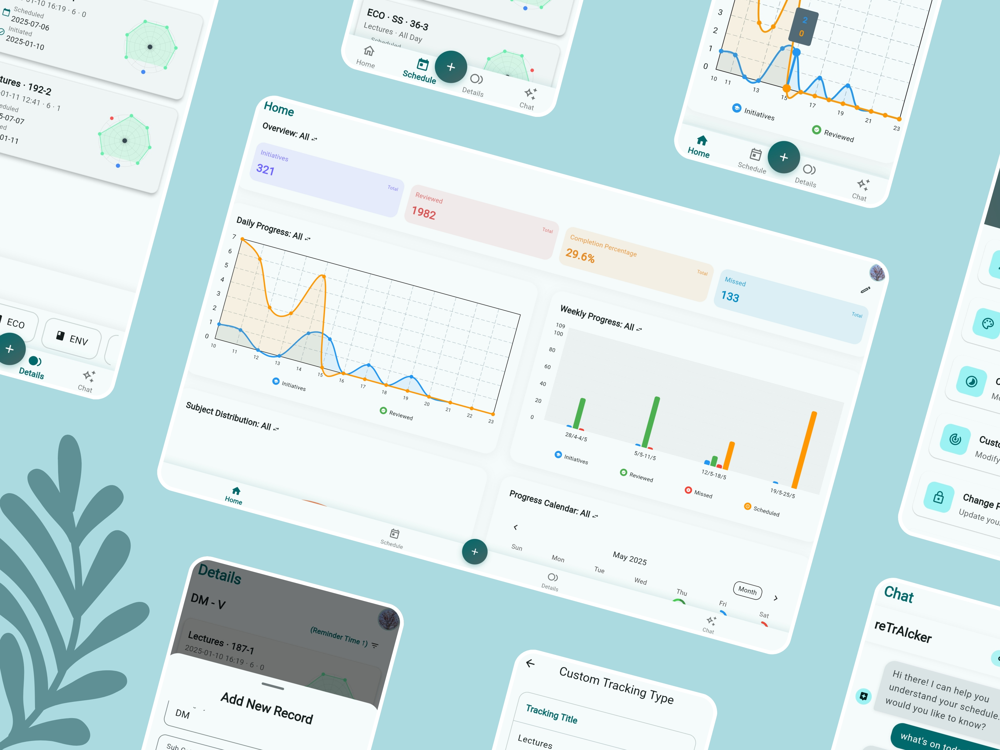
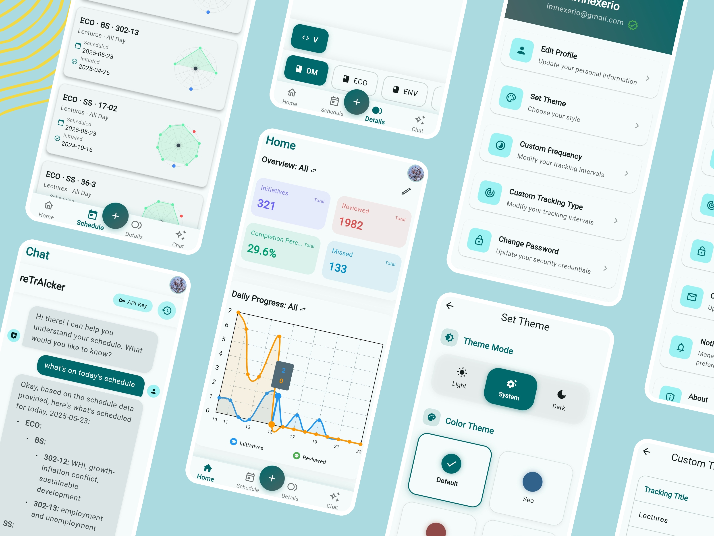

# revix

A powerful Flutter-based task scheduling and productivity application integrated with Firebase for secure data storage and authentication, featuring AI-powered assistance for enhanced productivity.

## 📋 Overview

revix is a comprehensive task management solution designed to help you organize, schedule, and track your tasks efficiently. Built with Flutter and powered by Firebase, it provides a seamless cross-platform experience with real-time synchronization and advanced features.

## 🎯 App Screenshots

### Preview Gallery

<div align="center">
  
</div>

<div align="center">
   
</div>
<div align="center">
   
</div>

## ✨ Key Features

### 🔐 Authentication & Security
- Secure user authentication via email/password
- Firebase-powered user management
- Protected user data storage

### 📱 Task Management
- **Add Lecture/Task Form**: Streamlined task creation interface
- **Schedule Tracking**: Comprehensive scheduling system with today's view
- **Task Details**: Detailed view for each task with full information
- **Real-time Synchronization**: Instant updates across all devices

### 🤖 AI Integration
- **AI Chat Assistant**: Built-in AI chat powered by Gemini API
- **Smart Recommendations**: AI-powered task suggestions and productivity tips
- **Chat History**: Persistent conversation history for reference
- **Model Selection**: Choose from different AI models for varied assistance

### 🎨 Customization
- **Dynamic Theming**: Custom theme generator with multiple color schemes
- **Profile Management**: Personalized user profiles with customizable settings
- **Responsive Design**: Optimized for various screen sizes and orientations

### 📊 Analytics & Tracking
- **Progress Visualization**: Charts and graphs using FL Chart
- **Task Statistics**: Comprehensive tracking of task completion rates
- **Home Widget**: Quick access to tasks directly from home screen (Android)

### 🔧 Technical Features
- **Cross-platform Support**: Android, iOS, Web, and Desktop ready
- **Offline Capability**: Local data storage using Hive database
- **Image Support**: Task attachments with image compression
- **URL Launcher**: Direct links to external resources
- **Package Info**: App version and build information tracking

## 🔧 Prerequisites

Before getting started, ensure you have the following installed on your development machine:

- [Flutter SDK](https://docs.flutter.dev/get-started/install) (v3.5.4+ recommended)
- [Dart SDK](https://dart.dev/get-dart) (included with Flutter)
- [Android Studio](https://developer.android.com/studio) or [VS Code](https://code.visualstudio.com/) with Flutter extensions
- [Firebase CLI](https://firebase.google.com/docs/cli) (`npm install -g firebase-tools`)
- A [Firebase](https://console.firebase.google.com/) account
- [Git](https://git-scm.com/) for version control

## 🏗️ Tech Stack

### Frontend Framework
- **Flutter**: Cross-platform UI framework
- **Dart**: Programming language

### Backend Services
- **Firebase Core**: Backend infrastructure
- **Firebase Database**: Real-time database
- **Firebase Auth**: Authentication service
- **Firebase Storage**: File storage

### AI Integration
- **Gemini API**: AI-powered chat assistant
- **Custom AI Models**: Multiple model selection

### Local Storage
- **Hive**: Fast, lightweight local database
- **Shared Preferences**: Key-value storage

### Additional Libraries
- **FL Chart**: Data visualization
- **Provider**: State management
- **Image Picker**: Camera and gallery access
- **URL Launcher**: External link handling
- **Path Provider**: File system access

## 🚀 Installation

### Step 1: Clone the Repository

```sh
git clone https://github.com/imnexerio/revix.git
cd revix
```

### Step 2: Set Up Firebase

1. Go to the [Firebase Console](https://console.firebase.google.com/)
2. Create a new project (with any name of your choice)
3. Set up Realtime Database:
   - Navigate to "Realtime Database" in the Firebase console
   - Click "Create Database"
   - Start in test mode, then switch to the rules below
4. Set up Firebase Storage:
   - Navigate to "Storage" in the Firebase console
   - Click "Get started" and follow the setup wizard
5. Enable Email/Password Authentication:
   - Navigate to "Authentication" in the Firebase console
   - Under "Sign-in method", enable "Email/Password"
6. Configure Flutter project with Firebase:
   ```sh
   # Install FlutterFire CLI if not already installed
   dart pub global activate flutterfire_cli
   
   # Configure Firebase for your Flutter project
   flutterfire configure
   ```
   - Select the Firebase project you created
   - **Important**: Use `com.imnexerio.revix` as the Android package name
7. Update Realtime Database Rules:
   ```json
   {
     "rules": {
       "users": {
         "$uid": {
           ".read": "auth != null && auth.uid == $uid",
           ".write": "auth != null && auth.uid == $uid"
         }
       }
     }
   }
   ```

### Step 3: Set Up AI Features (Optional)

To enable AI chat functionality:

1. Get a Gemini API key from [Google AI Studio](https://makersuite.google.com/app/apikey)
2. The app will prompt you to enter your API key on first use of the AI chat feature
3. API keys are stored securely using local storage

### Step 4: Install Dependencies

```sh
flutter pub get
```

### Step 5: Run the Application

```sh
flutter run
```

## 🎮 Usage Guide

### Getting Started
1. **Sign Up/Login**: Create a new account or login with existing credentials
2. **Add Tasks**: Use the "Add Lecture/Task" form to create new tasks
3. **Schedule View**: Check your daily schedule in the "Today" section
4. **AI Assistant**: Access the AI chat for productivity tips and task suggestions

### Key Features Usage
- **Task Management**: Tap on any task to view detailed information
- **AI Chat**: Navigate to the chat section for AI-powered assistance
- **Settings**: Customize themes, manage profile, and configure preferences
- **Home Widget**: Enable for quick task access from your home screen (Android)

## 📱 Supported Platforms

- ✅ **Android** (Primary platform with extra features)
- ✅ **iOS** (Full feature support)
- ✅ **Web** (Progressive Web App)
- ✅ **Windows** (Desktop application)
- ✅ **macOS** (Desktop application)
- ✅ **Linux** (Desktop application)

## 🔧 Configuration

### Firebase Configuration
Ensure your Firebase configuration files are properly placed:
- Android: `android/app/google-services.json`
- iOS: `ios/Runner/GoogleService-Info.plist`
- Web: `web/firebase-config.js`

## 🔍 Troubleshooting

### Common Issues

1. **Firebase Connection Issues**
   - Verify that `flutterfire configure` completed successfully
   - Check that the package name matches `com.imnexerio.revix`
   - Ensure the Firebase configuration files are in the correct locations
   - Verify Firebase project has the necessary services enabled

2. **Build Failures**
   - Run `flutter clean` followed by `flutter pub get`
   - Ensure Android SDK is properly configured
   - Check that all required permissions are granted

3. **AI Chat Issues**
   - Verify Gemini API key is valid and properly entered
   - Check internet connectivity
   - Ensure API quota hasn't been exceeded

4. **Home Widget Issues (Android)**
   - Verify home widget permissions are granted
   - Check that the widget is properly added to the home screen
   - Ensure background processing permissions are enabled

### Debug Commands
```sh
# Clean and rebuild
flutter clean
flutter pub get
flutter run

# Check for dependency issues
flutter pub deps
flutter doctor

# Debug Firebase connection
flutterfire configure --project=your-project-id
```

## 🚀 Performance Optimization

- **Local Caching**: Uses Hive for fast local data access
- **Image Compression**: Automatic image optimization for storage
- **Lazy Loading**: Efficient memory usage with on-demand loading
- **Background Services**: Minimal battery impact with optimized background tasks

## 🔒 Security & Privacy

- **Data Encryption**: All user data is encrypted in transit and at rest
- **Authentication**: Secure Firebase authentication
- **API Security**: Secure API key management
- **Privacy**: No personal data is shared with third parties

## 📈 Version History

- **v1.2.1**: Current version with AI integration and enhanced UI
- **v1.2.0**: Added AI chat functionality and improved theming
- **v1.1.0**: Introduced home widget support and enhanced task management
- **v1.0.0**: Initial release with core task management features

## 🤝 Contributing

Contributions are welcome! Please feel free to submit a Pull Request.

### How to Contribute

1. **Fork the repository**
2. **Create your feature branch**
   ```sh
   git checkout -b feature/amazing-feature
   ```
3. **Commit your changes**
   ```sh
   git commit -m 'Add some amazing feature'
   ```
4. **Push to the branch**
   ```sh
   git push origin feature/amazing-feature
   ```
5. **Open a Pull Request**

### Development Guidelines

- Follow Flutter/Dart best practices
- Ensure all tests pass before submitting
- Update documentation for new features
- Follow the existing code style and formatting
- Add appropriate comments for complex logic

### Areas for Contribution

- 🐛 Bug fixes
- ✨ New features
- 📚 Documentation improvements
- 🎨 UI/UX enhancements
- 🔧 Performance optimizations
- 🧪 Test coverage improvements

## 📄 License

This project is licensed under the GNU General Public License v3.0 - see the [LICENSE](LICENSE) file for details.

## 📬 Contact & Support

- **Developer**: [imnexerio](https://github.com/imnexerio)
- **Project Repository**: [https://github.com/imnexerio/revix](https://github.com/imnexerio/revix)
- **Issues**: [Report bugs or request features](https://github.com/imnexerio/revix/issues)

## 🙏 Acknowledgments

- Flutter team for the amazing framework
- Firebase for robust backend services
- Google AI for Gemini API integration
- Open source community for various packages and libraries

---

<div align="center">
  <p>Made with ❤️ by <a href="https://github.com/imnexerio">imnexerio</a></p>
  <p>⭐ Star this repo if you find it helpful!</p>
</div>
